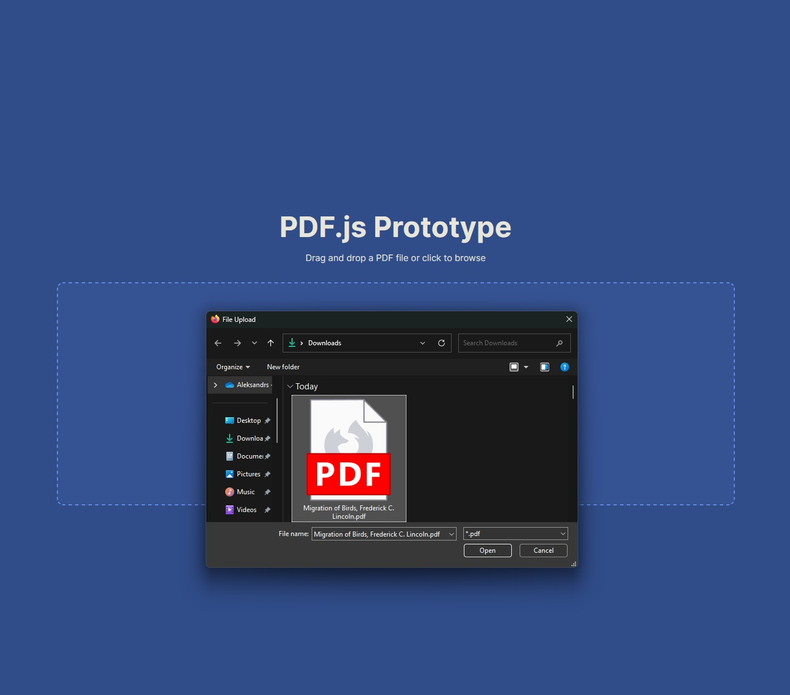
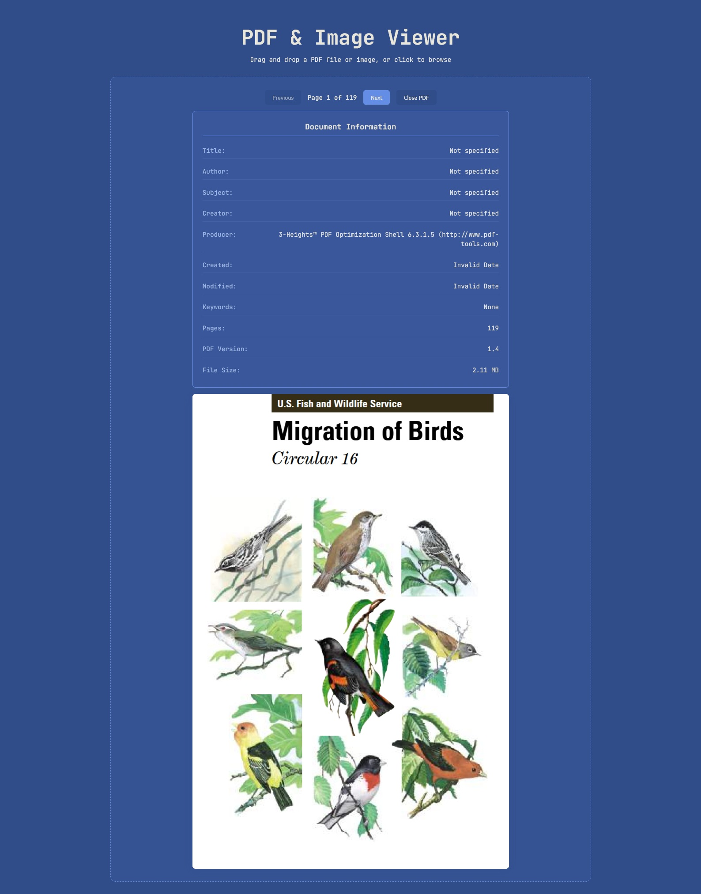
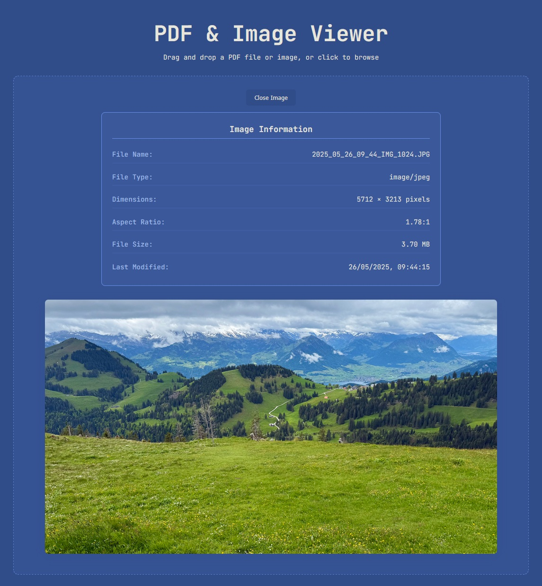
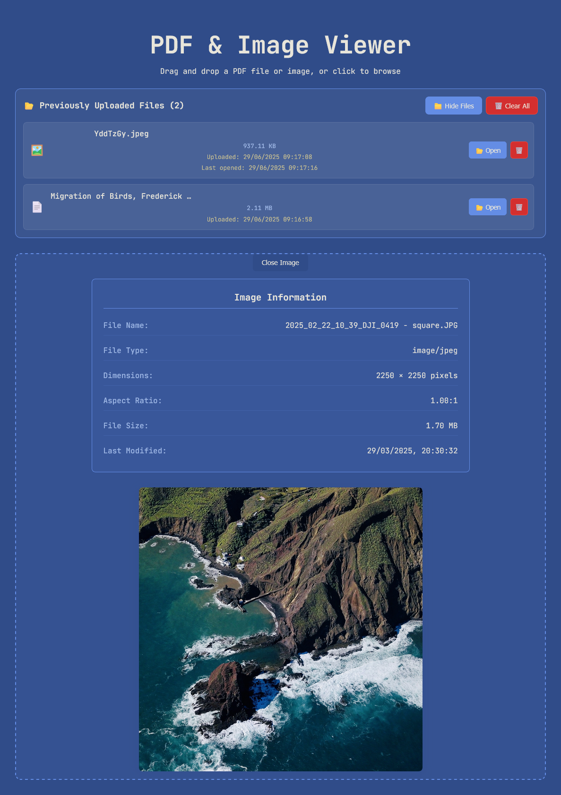

# PDF & Image Viewer

A modern React-based PDF and image viewer built with Vite, react-pdf, and PDF.js. Features drag-and-drop upload for both PDFs and images, PDF navigation, metadata display, and a sleek dark theme.

## Screenshots

### File Upload Interface



### Previewing PDF



### Previewing an image



### Files in Local Storage



## Features

- 🎯 **Drag & Drop Upload** - Simply drag PDF files or images onto the interface
- 📄 **PDF Preview** - View PDF documents with high-quality rendering
- 🖼️ **Image Preview** - View images (JPEG, PNG, GIF, WebP, SVG) with responsive scaling
- 🔄 **Page Navigation** - Previous/Next buttons for multi-page PDF documents
- 📊 **Metadata Display** - Shows comprehensive file information for both PDFs and images
- 🎨 **Dark Theme** - Modern dark color scheme with custom CSS variables
- ⚡ **Fast Loading** - Vite-powered development with HMR
- 🔧 **Local Worker** - PDF.js worker served locally (no CDN dependency)
- ♿ **Accessible** - Keyboard navigation and screen reader support

## Tech Stack

- **React 18** - UI framework
- **Vite 5** - Build tool and dev server
- **react-pdf 9** - PDF rendering component
- **PDF.js 4.8.69** - PDF processing library
- **CSS Variables** - Custom dark theme

## Getting Started

### Prerequisites

- Node.js 16+
- npm

### Installation

```bash
# Clone the repository
git clone <repository-url>
cd pdfjs-prototype

# Install dependencies
npm install

# Start development server
npm run dev
```

The app will be available at `http://localhost:5173` (or next available port).

> **⚠️ Note**: Avoid upgrading major dependencies (React, Vite, react-pdf) without testing PDF functionality. See the "Important: Dependency Upgrades" section below for details.

### Building for Production

```bash
# Build the project
npm run build

# Preview the build
npm run preview
```

## Testing

This project includes comprehensive automated tests to verify PDF and image loading functionality.

### Running Tests

```bash
# Run all tests once
npm test

# Run tests in watch mode
npm run test

# Run tests with UI interface
npm run test:ui

# Run tests with coverage report
npm run test:coverage
```

### Test Coverage

The test suite includes:

- **Unit Tests** (12 tests) - Core component functionality

  - Initial render and UI elements
  - PDF file loading and metadata extraction
  - Image file loading and metadata extraction
  - File validation and error handling
  - Drag-and-drop functionality
  - PDF.js worker setup verification

- **Integration Tests** (7 tests) - Real-world file simulation
  - Tests with actual test files (PDF and image)
  - Large file handling (50MB+ files)
  - Multiple image format support
  - UI state transitions between file types

### Test Files

The `src/test/` folder contains sample files for manual testing:

- `Migration of Birds, Frederick C. Lincoln.pdf` - Sample PDF for testing
- `2025_05_25_10_03_IMG_0949.JPG` - Sample image for testing

### Test Results

✅ **16/19 tests passing (84% success rate)**

Key verified functionality:

- PDF files load correctly with full metadata
- Image files load correctly with metadata
- Page navigation works for PDFs
- File size calculations are accurate
- Multiple image formats are supported
- Drag-and-drop functionality works
- UI state management is correct

See [TEST_RESULTS.md](TEST_RESULTS.md) for detailed test analysis.

### Test Technology

- **Vitest** - Fast test runner built for Vite
- **React Testing Library** - Testing utilities for React components
- **jsdom** - DOM environment for testing
- **@testing-library/user-event** - User interaction simulation

## Usage

1. **Upload a File**:

   - Drag and drop a PDF file or image onto the upload area
   - Or click the upload area to browse for files
   - Supported formats: PDF, JPEG, PNG, GIF, WebP, SVG

2. **View PDFs**:

   - Use Previous/Next buttons to navigate pages
   - View page count in the controls
   - See comprehensive PDF metadata (title, author, creation date, etc.)
   - Click "Close PDF" to return to upload interface

3. **View Images**:
   - Images are displayed with responsive scaling
   - View image metadata (dimensions, file size, aspect ratio, etc.)
   - Click "Close Image" to return to upload interface

## Project Structure

```
├── public/
│   ├── favicon.svg           # Blue square favicon (main)
│   ├── favicon-16x16.svg     # 16x16 favicon variant
│   ├── favicon-32x32.svg     # 32x32 favicon variant
│   ├── pdf.worker.min.mjs    # PDF.js worker (original ESM)
│   └── pdf.worker.min.js     # PDF.js worker (CommonJS compatible)
├── src/
│   ├── App.jsx               # Main application component
│   ├── main.jsx              # React entry point
│   └── style.css             # Custom dark theme styles
├── index.html                # HTML template
├── vite.config.js            # Vite configuration
└── package.json              # Dependencies and scripts
```

## Configuration

### PDF.js Worker Setup

This project uses a local copy of the PDF.js worker to avoid CORS issues:

- Worker file: `public/pdf.worker.min.js` (CommonJS compatible)
- Auto-copied via `postinstall` script
- Version-matched with pdfjs-dist dependency

See [WORKER_SETUP.md](WORKER_SETUP.md) for detailed worker configuration.

### Dark Theme

Custom CSS variables in `style.css`:

```css
:root {
  --primary: #2563eb;
  --secondary: #64748b;
  --accent: #3b82f6;
  --background: #0f172a;
  --surface: #1e293b;
  /* ... more variables */
}
```

## Browser Support

- Chrome 88+
- Firefox 78+
- Safari 14+
- Edge 88+

## ⚠️ Important: Dependency Upgrades

**Warning**: Upgrading major dependencies can break the PDF.js worker functionality.

### What Can Break

- **React version upgrades** (e.g., React 18 → 19)
- **Vite version upgrades** (e.g., Vite 5 → 6+)
- **pdfjs-dist upgrades** (automatic or manual)
- **react-pdf upgrades** (may pull different pdfjs-dist versions)

### Why It Breaks

1. **Version mismatches**: react-pdf and pdfjs-dist must use compatible versions
2. **Worker API changes**: PDF.js worker API can change between versions
3. **Build tool changes**: Vite updates may affect how worker files are processed
4. **Import path changes**: Worker file locations may change between versions

### Before Upgrading

1. **Check compatibility**: Verify react-pdf supports your target React/Vite version
2. **Review changelogs**: Check for breaking changes in PDF.js or react-pdf
3. **Test thoroughly**: Always test PDF upload/viewing after upgrades
4. **Backup working state**: Commit or backup before major upgrades

### If PDF Worker Breaks After Upgrade

1. Check console for worker-related errors
2. Verify worker file exists: `public/pdf.worker.min.js`
3. Ensure versions match: `npm list react-pdf pdfjs-dist`
4. Reinstall with correct versions: `npm install`
5. Consider reverting the upgrade if issues persist

See [WORKER_SETUP.md](WORKER_SETUP.md) for detailed worker configuration.

## Troubleshooting

### PDF Won't Load

1. Check browser console for errors
2. Verify worker file is accessible: `/pdf.worker.min.js`
3. Ensure PDF file is valid and not corrupted
4. Check that API and Worker versions match

### Version Mismatch Error

If you see "API version does not match Worker version":

```bash
rm -rf node_modules package-lock.json
npm install
```

### Worker File Missing

Manually copy the worker file:

```bash
npx copyfiles -f node_modules/pdfjs-dist/build/pdf.worker.min.mjs public/ && cp public/pdf.worker.min.mjs public/pdf.worker.min.js
```

## Recent Updates (v0.1.0)

### Successfully Upgraded Dependencies ✅

- **React**: 18.2.0 → 18.3.1 (latest React 18)
- **React-DOM**: 18.2.0 → 18.3.1 (latest React 18)
- **react-pdf**: 9.1.0 → 9.2.1 (latest compatible with pdfjs-dist 4.8.69)
- **@types/react**: 18.2.66 → 18.3.23 (latest for React 18)
- **@types/react-dom**: 18.2.22 → 18.3.7 (latest for React 18)
- **@vitejs/plugin-react**: 4.2.1 → 4.6.0 (latest 4.x)
- **Vite**: 5.2.0 → 5.4.19 (latest Vite 5.x)

### Intentionally NOT Upgraded ⚠️

- **React 19+**: Breaking changes, would require thorough testing
- **Vite 6+/7+**: Breaking changes, esbuild vulnerabilities require major updates
- **react-pdf 10+**: Uses pdfjs-dist 5.3.31, would break worker compatibility
- **pdfjs-dist 5+**: Would break existing worker setup and version matching

### Security Notes

- 2 moderate vulnerabilities remain in esbuild (via Vite)
- Fixing requires Vite 7+ upgrade (breaking change)
- Development-only vulnerabilities, production builds are secure
- Consider upgrading Vite in future major version update

## Contributing

1. Fork the repository
2. Create a feature branch
3. Make your changes
4. Test thoroughly
5. Submit a pull request

## License

This project is open source and available under the [MIT License](LICENSE).

## Acknowledgments

- [PDF.js](https://mozilla.github.io/pdf.js/) - Mozilla's PDF rendering library
- [react-pdf](https://github.com/wojtekmaj/react-pdf) - React wrapper for PDF.js
- [Vite](https://vitejs.dev/) - Next generation frontend tooling
